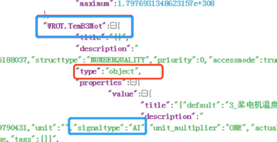

# List Thing Models

获取模型列表。

## 请求格式

```
GET {apigw-address}/modelService/thingModels?orgId={}&pageSize={}&pageToken={}&scope={}
```

## 请求参数

| **名称**  | **数据类型** | **是否必须** | **示例值** | **描述**                                                                                                                                                                                                                                          |
|:----------|:-------------|:-------------|:-----------------|:--------------------------------------------------------------------------------------------------------------------------------------------------------------------------------------------------------------------------------------------------|
| orgId     | String       | true         |                  | 资产所属的组织ID。[如何获取orgId信息>>](/docs/api/zh_CN/2.0.9/api_faqs#id-orgid-orgid)|
| scope     | Integer      | false        | 0                | 查询范围。 <br>· 0：只从orgId指定的组织搜索私有模型； <br>· 1：从orgId指定的组织搜索私有模型及和公有模型；<br>· 2：只搜索平台的公有模型。<br>默认为1|
| pageSize  | Integer      | true         | 5                | 每页记录数  |
| pageToken | Integer      | true         | 1                | Page token of the current page|


## 响应参数

| **名称**   | **数据类型**        | **描述**                                                                                 |
|:-----------|:--------------------|:-----------------------------------------------------------------------------------------|
| data       | Object              | 物模型的分页列表                                                               |
| pageToken  | Integer             | Current page number                                                                      |
| pageSize   | Integer             | 每页记录数           |
| totalSize  | Integer             | Total size                                                                               |
| data       | List<ThingModel>    | 物模型列表  |
| id         | String              | 物模型ID                                                                           |
| orgId      | String              | 物模型所属的组织ID                                        |
| name       | Object              | 该资产的各语言名称                                            |
| desc       | String              | 物模型描述 |
| category   | String              | 物模型类别                                                                    |
| jsonschema | String              | 物模型的完整描述，是一个json schema                            |
| parentId   | String              | 父模型ID。<br> 若值为空，则该物模型不是继承模型             |
| copyFromId | String              | 复制模型ID。<br> 若值为空，则该模型不是由其它模型复制而来 |
| tags       | Map<String, String> | 用户对物模型的自定义标签                                 |

## 示例 1

### 返回示例

```
 {
  "status": 0,
  "msg": "Success",
  "submsg": null,
  "data": {
    "page": 1,
    "pageSize": 5,
    "totalSize": 2,
    "data": [
      {
        "id": "cshan111603",
        "orgId": "1ad3889266800000",
        "name": {
          "defaultValue": "cshan111603",
          "i18nValue": {
            "en_US": ""
          }
        },
        "desc": "dfdfdf",
        "category": "",
        "jsonschema": "{\"id\":\"\",\"type\":\"object\",\"properties\":{\"measurepoints\":{\"id\":\"\",\"type\":\"object\",\"additionalProperties\":false},\"attributes\":{\"id\":\"\",\"type\":\"object\",\"properties\":{\"int111\":{\"title\":\"{\\\"default\\\":\\\"int111\\\",\\\"en_US\\\":\\\"\\\"}\",\"description\":\"{\\\"unit\\\":\\\"\\\",\\\"unit_multiplier\\\":\\\"ONE\\\",\\\"actualdesc\\\":\\\"\\\",\\\"numbertype\\\":\\\"INT\\\",\\\"accessmode\\\":true,\\\"tags\\\":{}}\",\"id\":\"int111\",\"default\":111,\"type\":\"integer\",\"minimum\":-2147483648,\"maximum\":2147483647},\"str222\":{\"title\":\"{\\\"default\\\":\\\"str222\\\",\\\"en_US\\\":\\\"\\\"}\",\"description\":\"{\\\"actualdesc\\\":\\\"\\\",\\\"accessmode\\\":true,\\\"tags\\\":{}}\",\"id\":\"str222\",\"default\":\"222\",\"type\":\"string\",\"maxLength\":1024},\"float333\":{\"title\":\"{\\\"default\\\":\\\"float333\\\",\\\"en_US\\\":\\\"\\\"}\",\"description\":\"{\\\"unit\\\":\\\"\\\",\\\"unit_multiplier\\\":\\\"ONE\\\",\\\"actualdesc\\\":\\\"\\\",\\\"numbertype\\\":\\\"FLOAT\\\",\\\"accessmode\\\":true,\\\"tags\\\":{}}\",\"id\":\"float333\",\"default\":33.3,\"type\":\"number\",\"minimum\":-3.4028235E38,\"maximum\":3.4028235E38}},\"required\":[\"str222\"],\"additionalProperties\":false},\"services\":{\"id\":\"\",\"type\":\"object\",\"additionalProperties\":false},\"events\":{\"id\":\"\",\"type\":\"object\",\"additionalProperties\":false}},\"required\":[\"attributes\"],\"additionalProperties\":false}",
        "parentId": null,
        "copyFromId": "cshan111602",
        "tags": {
          "year": "1990",
          "author": "cshan"
        }
      },
      {
        "id": "cshan111602",
        "orgId": "1ad3889266800000",
        "name": {
          "defaultValue": "cshan111602",
          "i18nValue": {
            "en_US": ""
          }
        },
        "desc": "aa",
        "category": "",
        "jsonschema": "{\"id\":\"\",\"type\":\"object\",\"properties\":{\"measurepoints\":{\"id\":\"\",\"type\":\"object\",\"additionalProperties\":false},\"attributes\":{\"id\":\"\",\"type\":\"object\",\"additionalProperties\":false},\"services\":{\"id\":\"\",\"type\":\"object\",\"additionalProperties\":false},\"events\":{\"id\":\"\",\"type\":\"object\",\"additionalProperties\":false}},\"required\":[\"attributes\"],\"additionalProperties\":false}",
        "parentId": null,
        "copyFromId": null,
        "tags": {
          "author": "cshan"
        }
      }
    ]
  }
}
```

.. note:: 模型中带质量位的测点 type 是 object  ；signaltype 需要从 properties.value.decription 中取



### 异常示例

```
{
    "status": 400,
    "msg": "Invalid Argument orgId",
    "submsg": "orgId does not exist"
}
```
