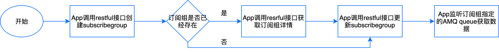

获取订阅的实时数据类
====================

**获取订阅数据的流程**

.. toctree::
   :maxdepth: 1

   createsubscribegroup
   getsubscribegroup
   updatesubscribegroup
   deletesubscribegroup
   listsubscribegroups
   subscribepointinfostruc
   invokeservicebydevicekey
   invokeservicebyassetid
   setmeasurepointbydevicekey
   setmeasurepointbyassetid
   multiinvokeserviceasync
   multisetmeasurepointasync
   createcontrolchannel
   getcontrolchannel
   updatecontrolchannel
   deletecontrolchannel
   listcontrolchannels
   createsetmeasurepointchannel
   getsetmeasurepointchannel
   updatesetmeasurepointchannel
   deletesetmeasurepointchannel
   listsetmeasurepointchannels
